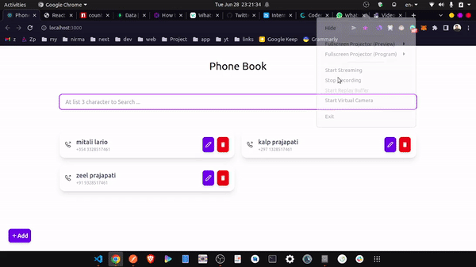

# Phone Book

# About

Phone book application with CRUD operations.

# Tech

1. React js, Tailwind
2. Node js , Express js
3. Mongodb

# Setup

1. Clone the repository
2. Run bellow commands to run server

    ```bash
    cd backend
    npm i
    npm run dev
    ```

3. Run bellow commands to run client

    ```bash
    cd client
    npm i
    npm run start
    ```

# Output

Find Output : [hear](./output.gif)



```

```
